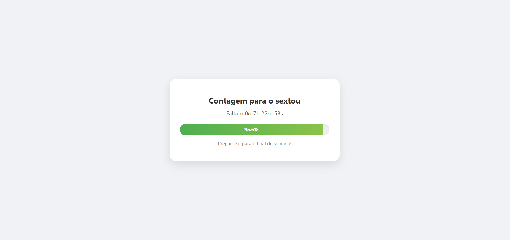

# 🚀 Contagem para a Sexta-Feira

Uma aplicação web simples e dinâmica que exibe uma barra de progresso em tempo real indicando quanto tempo falta para a próxima sexta-feira. Quando o objetivo é alcançado, a página celebra com uma animação de confetes! 🎉


## 📋 Sobre o Projeto

O objetivo deste projeto é calcular o tempo restante entre o momento atual e a próxima sexta-feira às 00:00. A barra de progresso utiliza um ciclo de 7 dias (da sexta anterior até a próxima) para mostrar a evolução da semana.




### ✨ Funcionalidades
- **Barra de Progresso Dinâmica:** Atualizada em tempo real via JavaScript.
- **Contagem Regressiva:** Exibição detalhada em dias, horas, minutos e segundos.
- **Efeito de Confetes:** Disparado automaticamente assim que a sexta-feira chega.
- **Design Responsivo:** Adaptado para telas de celulares e computadores.

## 🛠️ Tecnologias Utilizadas

* **HTML5:** Estrutura da página.
* **CSS3:** Estilização e animações suaves.
* **JavaScript (Vanilla):** Lógica de cálculo de datas e manipulação do DOM.

## 🚀 Como rodar o projeto

1.  Clone este repositório:
    ```bash
    git clone [https://github.com/laurabgularte/contagem-sexta.git](https://github.com/laurabgularte/contagem-sexta.git)
    ```
2.  Acesse a pasta do projeto:
    ```bash
    cd contagem-sexta
    ```
3.  Abra o arquivo `index.html` no seu navegador de preferência.

---
Desenvolvido com ansiedade pelo fim de semana!